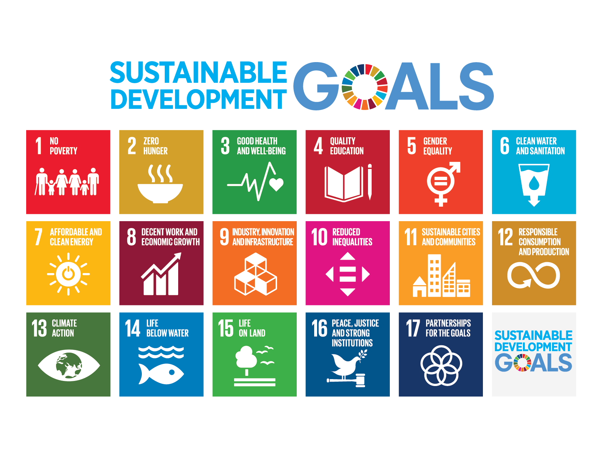

The path to a sustainable world: industry 4.0, blockchain technologies and smart cities are leading the paradigm shift of doing business. 

We could define 2030 like: "2030 (MMXXX) will be a common year starting on Tuesday of the Gregorian calendar..." — [Wikipedia](https://en.wikipedia.org/wiki/2030) but nothing farther than a common year for us. In 2030 we should have completed the Sustainable Development Goals ([SDG](https://www.un.org/sustainabledevelopment/sustainable-development-goals/)) defined by the United Nations in 2015. With a time frame of 15 years, it requires the partnership of governments, the private sector, civil society and citizens alike to make sure we leave a better planet for future generations.  

Did you know that by 2030 the world population will reach an estimated amount of 8.5 billion people? 

Efficiency in the food supply and sustainable farming practices are indispensable to guarantee food availability. Unlikely for us farming is one of the biggest cause of worst air pollution in Europe. Encouraging good farming practices ensures farmers fully benefit from the environment and at the same time conserving it for future generations. Additionally, instigating innovative and sustainable travel and transportation solutions must play a vital role in this process.

## Blockchain 

Blockchain technologies are disrupting well-established business models from finances to supply chain management removing the need for a middleman. Thanks to its decentralized and secure nature we are able to processes at much lower cost and with greater speed, security, and transparency in any economic transaction. 
Blockchain, through decentralized applications, gives us enormous potential leverage to solve the biggest challenges of the SDG.

https://feature.undp.org/beyond-bitcoin/

## Industry 4.0

The industry 4.0 also called "smart factory" is revolutionizing the way we are providing and consuming goods from the automation and data exchange in manufacturing technologies to the traceability of prime materials. This revolution empowers the rise of circular economies that minimize the waist and get the most of the resources closing the loop for sustainable development.   

## Smart cities 

Cities are not staying behind on this technology revolution, nowadays is a primary concern to improve their citizen's life quality. Planning the cities to be energy efficient, self-sustainable, pedestrian friendly and implementing IOT (Internet Of Things) to collect data permit them to achieve their sustainability goals and generate a positive impact on nearby areas.
These new concepts and technologies impulse the creation of new business developments, for example : 

 - IOT technologies  
 - Decentralized apps for energy consumption
 - self-driving solutions 
 - Local and circular economies  

Cities leading on these fields are extraordinary use cases to follow and promote around the world.     

## Conclution 

While we still have a long path ahead and an incredible amount of things to improve I'm convinced that raising awareness of climate change and implementing technology solutions whenever we can is the path to achieve a sustainable world. 

This should be the legacy of our generation for all to come.

### references 

https://www.un.org/sustainabledevelopment/blog/2015/07/un-projects-world-population-to-reach-8-5-billion-by-2030-driven-by-growth-in-developing-countries/

https://barriolapinada.es

https://www.thesustainablecity.ae/

Photo by Gemma Evans on Unsplash