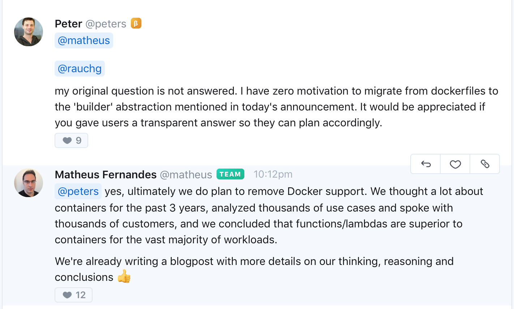

I have been following [Zeit](https://zeit.co/) for a while , a company that provides easy management of cloud infrastructure through their CLI tool [Now](https://zeit.co/now), they characterize for having top-notch team lead by Guillermo Rauch [@rauchg](https://twitter.com/rauchg) (a well know figure in the javascript ecosystem) and a wide set of open source tools, frameworks and libraries (https://github.com/zeit), they are a young but promising company that strives to reduce friction between writing code and deploying it to the cloud. 

>Make Cloud Computing as Easy and Accessible as Mobile Computing.

That being said I would like to tell you a history about their latest product release [Now 2.0](https://zeit.co/blog/now-2) and how they went from the serverless docker containers to Lambdas function model, let's get started.      


### Now serverless docker 

In August of 2018 they have announced the release of a public beta for [Serverless Docker Deployments](https://zeit.co/blog/serverless-docker) the premise was simple: write your whole infrastructure on dockerfiles and deploy them on the cloud in one command! sounds amazing, right?  

<iframe src="https://www.youtube.com/embed/yqACl3tRHNI?ecver=2&start=1453" style="position:absolute;width:100%;height:100%;left:0" width="640" height="360" frameborder="0" allow="autoplay; encrypted-media" allowfullscreen></iframe>

Yeah! lets port all our docker containers to Zeit , use Now cli and production ready in one command straight in the cloud! in your face AWS! well no that fast my friend ...  

https://spectrum.chat/zeit/now/clarify-future-support-of-docker-on-now-platform~96985341-e17f-4af4-a330-c726774ed436




Unfortunately, this change on the platform haven't been well informed/documented or anticipated by Zeit and generate a lot of unhappy developers in their community :(. The deprecation announcement of serverless docker service took by surprise all early adopters, furthermore they didn't create an official statement of the reasons for such change neither mentioned when your code will stop running on Now V1, taking by surprise all early adopters of this technology and creating a lot of uncertain in a field where you can't be uncertain :D, not cool! 


### Now 2.0 

So what about Now 2.0? They have a new model base on lambda functions, no more containers, instead of docker files now you have to create a JSON configuration file specifying the [builders](https://github.com/zeit/now-builders) you going to use for each file type and the routes of your app as the minimum requirement.

```javascript
{
  "builds": [
    { "src": "*.php", "use": "@now/php" },
    { "src": "*.html", "use": "@now/static" }
  ],
   "routes": [
    { "src": "/a/new(/route)?", "dest": "src/another-route.js" }
  ]
}
```

Some of the flaw points at the time of writing this post (December 2018) 

 - Now CLI doesn't have a localhost mode so we can't replicate the project locally, at least on v1 you could reproduce the docker containers locally avoiding discrepancies between dev and prod environments. They are working on ````now dev```` command not released yet.
 - Lack of support for Typescrip , though you could create your own builder https://github.com/zeit/now-builders/issues/46
 - If there isn't an official [Zeit builder](https://github.com/zeit/now-builders) for your use case you end up writing code that is only required by their platform, this is a lock-in code because can't be reused anywhere else and add the overhead of having to learn a new API for customizing your builds. While this is an NPM module and the whole tool is open source, i don't imagine people with Python/Go having to write javascript code just to build their projects (https://zeit.co/docs/v2/deployments/builders/developer-guide/) 
 - The platform seems not to have the quality standard they used to provide, it seems they released a beta project but without the beta label, however, they are putting a lot of effort to improve and assist their costumers
  
---


So why the switch? ... 

### Size matter!

Yes ladies, the size matter, fortunately for us smaller the better! 

Docker images sizes are big compared to the code you need to execute for running your business logic,  more code you deploy more time it takes to run, in a world where the trend is to go minimalist, containers are not a great fit. 
Having big images increase costs for running infrastructure and make harder for them to unfreeze instances, reduce the time for cold starts and scale the process for huge amounts of requests while keeping the cost as minimum as possible is inviable with this model. 
 

### Conspiracy theory 

Some folks in the community think that the abrupt release of Now 2.0 and deprecation of v1 follow the request of stockholders for a possible acquisition from some of the biggest cloud providers (AWS)

### Cloud Flare 

you wonder what CloudFlare has to do on all this, it may be that they just released an infrastructure model that can be faster, secure and cheap to run that docker serverless containers, meaning that if you don't shift your strategy 100% you may end up being irrelevant  

https://blog.cloudflare.com/cloud-computing-without-containers/


### Conclusion 

The majority of the Zeit community feelt unhappy or [disappointed](https://spectrum.chat/zeit?thread=cbad7540-8159-41a7-9767-9c3f6310b497) with the way they announced the release of Now 2.0, this brought a lot of uncertainty to the community and when is time to choose your cloud provider for your client uncertainty is something you don't want in the equation.

>“Organizations which design systems ... are constrained to produce designs which are copies of the communication structures of these organizations.”
— M. Conway

What do you think ? should we give a second chance to Zeit? 

Yes, I believe they will keep pushing the _state of the art for cloud computing and development experience_, is not an easy path though, but I trust the team behind Zeit will improve their communication strategy going on. I hope this was just a small bump on their way, that being said, I wouldn't deploy critical business process to their infrastructure until it reaches a certain maturity.  


